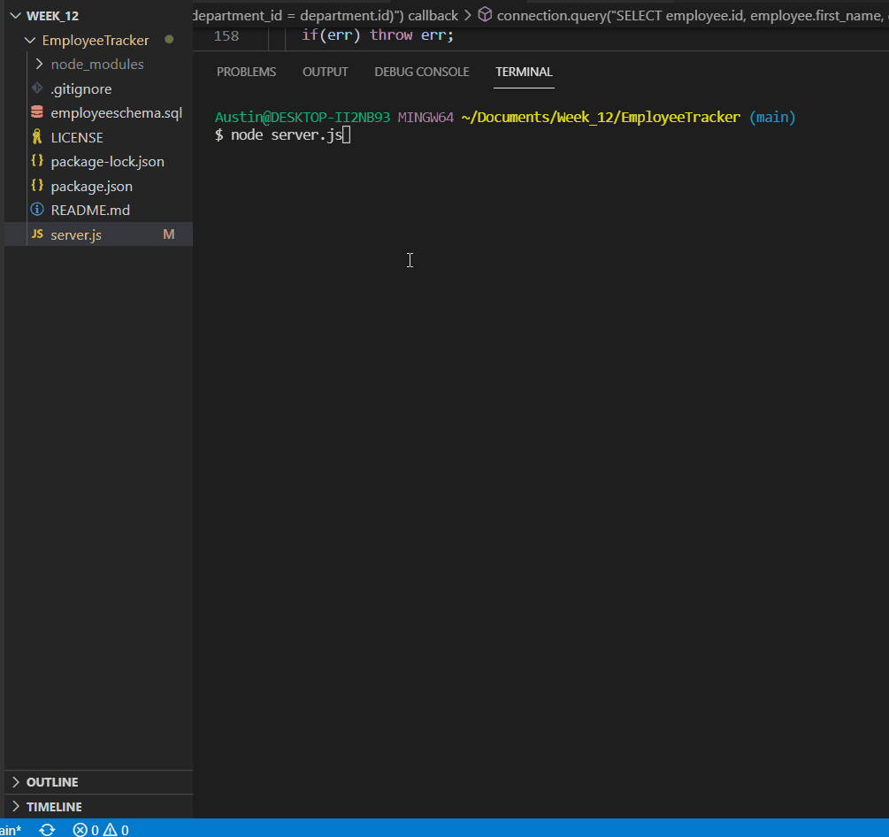

# EmployeeTracker
 

## Description
The Employee Tracker allows a user to build their company structure, departments, roles, and individual employees, view each of these catergories, and update an employees role when they move around the company. This application utilizes a mysql database to store information. 

## Table of Contents
  - [Description](#description)
  - [Installation](#installation)
  - [Usage](#usage)
  - [License](#license)
  - [Testing](#testing)
  - [Contributions](#contributions)  
  - [Questions and Contact](#questions-and-contact)
  - [Credits](#credits)

## Installation
- To install this application, first clone to repo to your local device.
- Make sure to install node.
- Run ***npm init***
- Run ***npm install inquirer***
- Run ***npm install console.table***
- Run ***npm install mysql***
- Run ***npm install colors***

Make sure that you enter your mysql username and password in the beginning of the server.js file to link to your mysql database.

## Usage
This app is used to add departments, roles, and employees for a business, storing this data in mysql database. The user can view each catergory that has been created, and update an employee role. Run the app using node in the bash terminal by typing the command ***node server.js***. A series of prompts will come up to allow you to move through the application. 
To stop at any point, type in ***ctrl c*** in the terminal and hit enter.

## License
  
  This application is licensed under the MIT license. Please click the link to read more about the license! 
  [License Information](https://choosealicense.com/licenses/mit/)

## Testing
Not available for this application.

## Contributions
:busts_in_silhouette: 
If you wish to contribute, please feel free to open an issue so we can discuss your ideas and develop a plan to move forward!
Pull requests will not be accepted without prior discussion, thank you. 

## Questions and Contact
  :grey_question::grey_question: 
  Please visit my GitHub profile  
  :octocat: https://github.com/aanolan51   
  Feel free to drop me a line!   :fountain_pen: nolana464@gmail.com

## Credits:
1. https://www.springboard.com/blog/data-science/joining-data-tables/
2. https://www.khanacademy.org/computer-programming/sql-create-table-with-foreign-key-reference/4700108318965760
3. https://dev.mysql.com/doc/mysql-tutorial-excerpt/5.7/en/example-foreign-keys.html
4. https://eecs.oregonstate.edu/ecampus-video/CS290/core-content/node-mysql/using-server-sql.html
5. https://learnsql.com/blog/how-to-join-two-tables-in-sql/
6. https://www.w3schools.com/nodejs/nodejs_mysql_join.asp
7. https://learnsql.com/blog/how-to-join-3-tables-or-more-in-sql/
